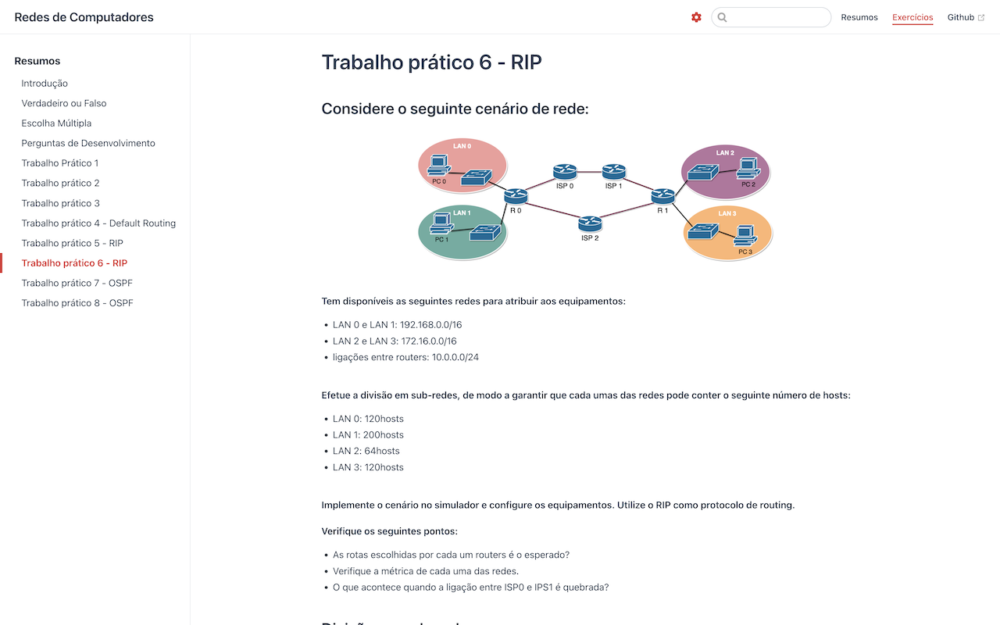

   

  
  

## 🚀 Tecnologias

[Vue.js](https://vuejs.org/)

[Vuepress](https://vuepress.vuejs.org/)

[mathjax](https://www.mathjax.org/)

## 💻 Projeto

Este projeto pretende ser um repositório de conhecimento de Redes de Computadores.

## 🔖 Layout

### dark and light

[vuepress-theme-yuu](https://vuepress-theme-yuu.netlify.app/)

 

   
   &nbsp;&nbsp;
   

